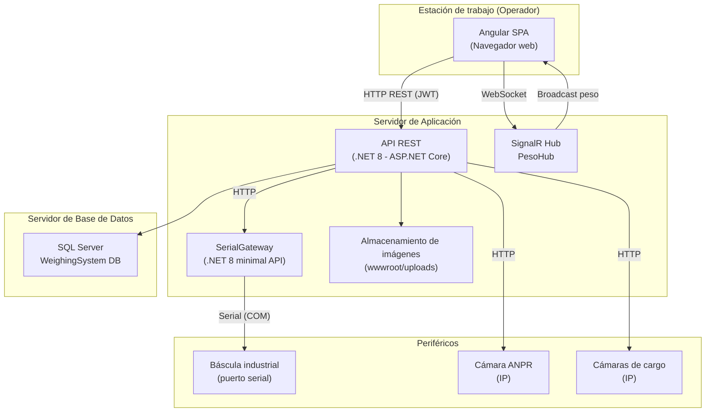

# Documento de Arquitectura de la Solución

---

| Campo              | Detalle                                      |
|--------------------|----------------------------------------------|
| **Proyecto**       | Kiriu Weighing System                        |
| **Versión**        | 1.0                                          |
| **Fecha**          | Abril 2026                                   |
| **Responsable**    | [Completar con información del proyecto]     |

---

## Introducción

Este documento describe la arquitectura de la solución implementada para el sistema de control de pesaje vehicular **Kiriu Weighing System**. Su propósito es ofrecer una visión clara y estructurada de los componentes que conforman el sistema, las tecnologías utilizadas, las decisiones técnicas relevantes y la forma en que los distintos módulos interactúan entre sí.

El documento está dirigido a arquitectos de solución, desarrolladores de mantenimiento y equipos de soporte técnico que necesiten comprender la solución para operar, escalar o dar continuidad al sistema.

---

## Objetivo de la solución

El sistema resuelve la necesidad de registrar, controlar y auditar operaciones de pesaje de vehículos en instalaciones con báscula industrial. Permite gestionar el ciclo completo de entrada y salida de unidades, incluyendo operaciones con doble remolque, captura fotográfica del estado del vehículo y carga, y generación de reportes.

Desde el punto de vista de negocio, la solución aporta:

- Trazabilidad completa del ciclo de pesaje por folio de operación.
- Registro fotográfico vinculado a cada operación.
- Control de acceso por roles y permisos para los operadores del sistema.
- Exportación de información operativa en formatos Excel y PDF.
- Pista de auditoría de todas las acciones críticas del sistema.

---

## Alcance

La solución abarca los siguientes dominios funcionales:

| Dominio                    | Descripción                                                                 |
|----------------------------|-----------------------------------------------------------------------------|
| Autenticación y seguridad  | Login, tokens JWT, sesiones concurrentes, roles y permisos                  |
| Operaciones de pesaje      | Registro de entrada, salida, doble remolque y contenedor                    |
| Captura de imágenes        | Integración con cámaras IP para fotografías de carga y vehículo             |
| Reconocimiento de placas   | Integración con sistema ANPR para captura automática de matrícula           |
| Monitoreo en tiempo real   | Lectura y transmisión del peso en vivo desde báscula vía SignalR             |
| Administración             | Gestión de usuarios, roles, permisos y módulos del sistema                  |
| Auditoría                  | Registro de acciones del sistema y ediciones manuales de operaciones        |
| Reportes y exportación     | Consulta de operaciones, exportación a Excel y generación de PDF            |

**Exclusiones:** El sistema no contempla integración con sistemas ERP ni facturación electrónica en esta versión. La configuración y mantenimiento de la báscula física es responsabilidad del proveedor del equipo.

---

## Vista general de arquitectura

La solución sigue el estilo de **arquitectura limpia (Clean Architecture)** en el backend y una **arquitectura orientada a módulos por funcionalidad** en el frontend. La comunicación entre ambas capas se realiza a través de una API RESTful, complementada con un canal de tiempo real basado en SignalR para la transmisión continua del peso.

Se identifican cuatro capas principales en el backend, un frontend independiente y dos servicios auxiliares:

```
[ Angular SPA (Frontend) ]
         |
         | HTTP REST / SignalR WebSocket
         v
[ API (.NET 8) ]         <--- [ SerialGateway (servicio local) ]
         |
[ Application Layer ]
         |
[ Infrastructure Layer ] ---> [ SQL Server ]
         |
[ Domain Layer ]
```

El frontend se comunica exclusivamente con la API REST del backend. La lectura del peso desde la báscula se realiza a través de un servicio auxiliar (`SerialGateway`) que expone la lectura serial del equipo como un endpoint HTTP/WebSocket consumible por la API principal.

---

## Componentes principales

### 1. Frontend Angular (SPA)

| Atributo         | Detalle                                                                 |
|------------------|-------------------------------------------------------------------------|
| **Objetivo**     | Interfaz de usuario para operadores y administradores del sistema       |
| **Tecnología**   | Angular 20, PrimeNG, TypeScript, SCSS, Angular SSR                      |
| **Dependencias** | API REST del backend, SignalR hub de peso                               |
| **Entradas**     | Interacción del usuario, respuestas de la API                           |
| **Salidas**      | Solicitudes HTTP a la API, capturas de cámara invocadas vía API         |

El frontend está organizado en módulos de funcionalidad:

- **auth**: Flujo de autenticación y login.
- **weighing**: Operaciones de pesaje (entrada, salida, doble remolque, consulta).
- **admin**: Gestión de usuarios, roles, permisos y módulos.
- **dashboard**: Vista de inicio post-autenticación.
- **shared / layout**: Componentes reutilizables (spinner global, breadcrumb, tarjetas, header).

Los componentes son standalone (Angular moderno sin NgModules). La navegación está protegida por guards de autenticación y un guard de flujo de pesaje que previene el acceso a pasos intermedios fuera de secuencia.

---

### 2. API Backend (.NET 8)

| Atributo         | Detalle                                                                       |
|------------------|-------------------------------------------------------------------------------|
| **Objetivo**     | Núcleo de la lógica de negocio y exposición de servicios REST                 |
| **Tecnología**   | .NET 8, ASP.NET Core, Entity Framework Core, FluentValidation, Mapster        |
| **Dependencias** | SQL Server, SerialGateway, cámaras IP ANPR                                    |
| **Entradas**     | Solicitudes HTTP autenticadas desde el frontend                               |
| **Salidas**      | Respuestas JSON, imágenes estáticas, transmisión SignalR de peso              |

La API expone los siguientes grupos de endpoints:

| Controlador               | Responsabilidad                                              |
|---------------------------|--------------------------------------------------------------|
| `AuthController`          | Login, refresh token, logout                                 |
| `WeighingController`      | Registro de operaciones de entrada y salida                  |
| `WeighingQueryController` | Consulta y exportación de operaciones                        |
| `UsuariosController`      | CRUD de usuarios                                             |
| `AdminController`         | Gestión de roles, permisos y módulos                         |
| `AnprController`          | Captura y consulta de placas por ANPR                        |
| `CargoCameraController`   | Captura fotográfica de carga                                 |
| `TrailerCameraController` | Captura fotográfica de trailer                               |
| `RemolqueCameraController`| Captura fotográfica de remolque                              |
| `AuditController`         | Consulta del registro de auditoría                           |
| `HealthCheckController`   | Estado del sistema                                           |
| `SignalRTestController`   | Diagnóstico del hub SignalR                                  |

La API también aloja el hub SignalR `PesoHub`, que transmite en tiempo real las lecturas de la báscula a los clientes conectados.

---

### 3. Capa de Dominio

| Atributo       | Detalle                                                        |
|----------------|----------------------------------------------------------------|
| **Objetivo**   | Modelar las entidades y contratos del negocio                  |
| **Tecnología** | C# puro, sin dependencias de frameworks externos              |

Contiene las entidades centrales del sistema:

| Entidad                 | Descripción                                                   |
|-------------------------|---------------------------------------------------------------|
| `WeighingOperation`     | Operación de pesaje (folio, pesos, estado, tipo, placas)      |
| `WeighingPhoto`         | Imagen asociada a una operación                               |
| `WeighingRemolque`      | Datos del segundo remolque en operación doble                 |
| `WeighingEditHistory`   | Historial de ediciones manuales sobre una operación           |
| `Usuario`               | Cuenta de usuario del sistema                                 |
| `Rol` / `Permiso`       | Modelo de control de acceso basado en roles                   |
| `Modulo`                | Módulo funcional del sistema                                  |
| `AuditLog`              | Registro de auditoría de acciones                             |
| `UserSession`           | Control de sesiones concurrentes                              |
| `FolioSequence`         | Generación secuencial de folios de operación                  |

---

### 4. Capa de Aplicación

| Atributo       | Detalle                                                             |
|----------------|---------------------------------------------------------------------|
| **Objetivo**   | Orquestar los casos de uso del sistema                              |
| **Tecnología** | C#, FluentValidation, Mapster                                       |

Contiene los servicios de aplicación que implementan los flujos del negocio:

| Servicio                        | Responsabilidad                                          |
|---------------------------------|----------------------------------------------------------|
| `AuthApplicationService`        | Autenticación, generación y renovación de tokens JWT     |
| `WeighingApplicationService`    | Registro y gestión del ciclo de pesaje                   |
| `WeighingQueryService`          | Consultas, filtros y exportación de operaciones          |
| `UsuarioApplicationService`     | Alta, baja y modificación de usuarios                    |
| `AdminApplicationService`       | Gestión de roles, permisos y módulos                     |
| `AnprApplicationService`        | Integración con el sistema de reconocimiento de placas   |
| `HealthCheckApplicationService` | Verificación del estado de componentes del sistema       |

---

### 5. Capa de Infraestructura

| Atributo       | Detalle                                                                 |
|----------------|-------------------------------------------------------------------------|
| **Objetivo**   | Acceso a datos, servicios externos y detalles técnicos de implementación |
| **Tecnología** | Entity Framework Core 8, SQL Server, SixLabors.ImageSharp, EPPlus       |

Incluye:

- `WeighingDbContext`: contexto EF Core con mapeo de todas las entidades.
- Repositorios para cada entidad del dominio.
- `AuthService`: hashing y verificación de contraseñas.
- `ImageCompressionService`: compresión de imágenes antes del almacenamiento.
- `AuditLoggerService`: registro centralizado de acciones auditables.
- `UserSessionService`: validación de sesiones concurrentes.
- `AuditInterceptor`: interceptor EF Core para captura automática de cambios.

---

### 6. SerialGateway

| Atributo         | Detalle                                                                     |
|------------------|-----------------------------------------------------------------------------|
| **Objetivo**     | Leer el peso en tiempo real desde la báscula vía puerto serial              |
| **Tecnología**   | .NET 8 minimal API, System.IO.Ports                                         |
| **Dependencias** | Puerto COM del equipo báscula físico                                        |
| **Entradas**     | Tramas seriales del equipo de pesaje                                        |
| **Salidas**      | Lectura de peso numérico expuesta como endpoint HTTP                        |

Este servicio se ejecuta de forma independiente en el equipo operativo que tiene conexión física al puerto serial de la báscula. La API principal lo consume para obtener la lectura actual del peso durante el flujo de captura.

---

### 7. Base de datos (SQL Server)

| Atributo         | Detalle                                                           |
|------------------|-------------------------------------------------------------------|
| **Objetivo**     | Persistencia de toda la información operativa del sistema         |
| **Tecnología**   | Microsoft SQL Server                                              |
| **Esquemas**     | `dbo` (seguridad y usuarios), `weighing` (operaciones y fotos)    |

Las migraciones se gestionan mediante scripts SQL idempotentes manuales, sin EF Core Migrations, para evitar conflictos de versión en ambientes productivos.

---

## Relación entre componentes

El flujo de comunicación típico del sistema es el siguiente:

1. El operador accede al **frontend Angular** e inicia sesión.
2. El frontend envía credenciales a la **API** (`AuthController`) y recibe un token JWT.
3. Con el token activo, el operador inicia una operación de pesaje.
4. La **API** consulta la lectura del peso al **SerialGateway** y la retransmite al frontend vía **SignalR**.
5. El operador confirma el peso y la cámara ANPR captura la placa del vehículo.
6. La **API** almacena la operación en **SQL Server** y guarda las imágenes comprimidas.
7. Al registrar la salida, la **API** completa el registro y calcula el peso neto.
8. El operador puede generar el comprobante en PDF o consultar reportes exportables a Excel.

Las dependencias entre componentes son unidireccionales: el frontend solo conoce a la API; la API conoce a la base de datos, al SerialGateway y a las cámaras IP.

---

## Patrón de captura de fotografías

El sistema implementa dos flujos diferenciados para la captura de imágenes, según el tipo de foto requerida. Entender esta distinción es clave para diagnóstico, soporte y mantenimiento de la integración con cámaras.

### Fotos de placa (ANPR) — flujo con fallback a cámara directa

Aplica para las fotos de placa del tráiler, remolque y contenedor (`trailerPlate`, `remolque1Plate`, `containerPlate`).

Las cámaras ANPR se disparan **automáticamente** al detectar el vehículo, antes de que el operador inicie la operación. La imagen puede ya existir en la base de datos como foto huérfana cuando el operador presiona "Capturar placa". Si no existe esa foto previa, el sistema tiene un **mecanismo de fallback** que captura directamente desde la cámara IP sin esperar a que la ANPR responda.

**Flujo completo:**

1. Al presionar el botón de captura, el sistema consulta si existe una **foto huérfana** reciente en BD (`GET /api/weighing/photos/orphan/latest/{photoType}`).
2. **Si existe foto huérfana**: la muestra de inmediato. Inicia escucha ANPR en segundo plano para reemplazarla si llega una captura más reciente.
3. **Si no existe foto huérfana**: captura **de inmediato** una foto directa desde la cámara IP (`POST /api/trailer-camera/capture-and-save` o `POST /api/remolque-camera/capture-and-save`). Esta foto se guarda como huérfana en BD, se muestra al operador y la placa queda registrada como `unknown`. En paralelo, inicia la escucha ANPR en segundo plano.
4. **Si llega evento ANPR antes del timeout (30 seg.)**: la foto existente (de BD o de cámara directa) se **reemplaza** con la imagen del evento ANPR, que incluye el texto de la placa detectada y el nivel de confianza.
5. **Si el timeout vence sin evento ANPR**: el sistema conserva la foto ya capturada sin mostrar error. Si se tomó por fallback de cámara, la placa permanece como `unknown`.

```
[Operador presiona "Capturar placa"]
         │
         ▼
¿Existe foto huérfana en BD?
         │
    Sí ──┤──→ Muestra foto de BD (provisional)
         │          │
    No ──┤          └──→ [Escucha ANPR en background, 30 seg.]
         │
         └──→ Captura directa desde cámara IP
              POST /api/trailer-camera/capture-and-save
              Placa = "unknown" | Guarda como huérfana en BD
              Muestra foto al operador
                   │
                   └──→ [Escucha ANPR en background, 30 seg.]

[Escucha ANPR en background]
         │
    ┌────┴────┐
    │         │
 Llega    Timeout
 evento     30s
    │         │
    ▼         ▼
Reemplaza  Conserva foto existente
foto con   (BD o cámara directa)
imagen     Sin error visible
ANPR +
placa
detectada
```

> Una **foto huérfana** es un registro de `WeighingPhotos` con `WeighingOperationId = NULL`. Se genera tanto cuando la cámara ANPR envía la imagen automáticamente, como cuando el sistema captura directamente por fallback. Al confirmar la operación, las fotos huérfanas se vinculan a ella. Las que superen el tiempo de vida configurado (`PhotoSettings.OrphanPhotoMaxAgeMinutes`, por defecto 10 minutos) son descartadas automáticamente.

---

### Fotos de carga — flujo de captura directa

Aplica para las fotos del estado del vehículo y la carga (`cargo`, `cargoEntry`, `cargoExit` y similares).

A diferencia de las cámaras ANPR, las cámaras de captura de carga **no se disparan automáticamente**. La captura es siempre iniciada por el operador, por lo que no existe foto previa en la base de datos que consultar.

El flujo es:

1. El frontend llama directamente al endpoint de la API (`POST /api/cargo-camera/capture-and-save`, `POST /api/trailer-camera/capture-and-save` o `POST /api/remolque-camera/capture-and-save`).
2. La API realiza una solicitud HTTP a la cámara Hikvision usando autenticación Digest para obtener el snapshot (`GET {CameraUrl}/ISAPI/Streaming/channels/1/picture`).
3. La imagen recibida se comprime antes de almacenarse.
4. Se crea un registro de foto huérfana en la base de datos (`WeighingOperationId = NULL`).
5. La API retorna la URL de la foto al frontend para mostrar la vista previa.
6. Al confirmar la operación, la foto huérfana se vincula a la operación correspondiente.

```
[Operador presiona "Capturar foto de carga"]
         |
         v
  Frontend → POST /api/cargo-camera/capture-and-save
         |
         v
  API → GET http://{IP_CAMARA}/ISAPI/Streaming/channels/1/picture
         |
         v
  Imagen recibida → Compresión (máx. 1280px, calidad 75)
         |
         v
  Guarda en BD como foto huérfana (WeighingOperationId = NULL)
         |
         v
  Retorna URL al frontend → Vista previa mostrada al operador
```

---

### Resumen comparativo

| Aspecto                          | Fotos de placa (ANPR)                              | Fotos de carga                                     |
|----------------------------------|----------------------------------------------------|----------------------------------------------------|
| Origen del disparo               | Automático (cámara detecta el vehículo)            | Manual (operador presiona el botón)                |
| Consulta de foto huérfana en BD  | Sí, siempre como primer paso                       | No; siempre captura nueva                          |
| Canal de comunicación            | Cámara → API (POST ANPR) → SignalR → Frontend      | Frontend → API → Cámara → API → Frontend           |
| Reemplazo por nueva captura      | Sí; el evento SignalR reemplaza la foto de BD      | No aplica; siempre es una nueva captura            |
| Protocolo con la cámara          | Cámara envía multipart/form-data con XML + imagen  | API solicita snapshot ISAPI vía HTTP GET           |
| Timeout de espera                | 30 segundos (configurable por componente)          | 10 segundos (timeout del cliente HTTP de la API)   |

---

## Diagrama de arquitectura

El siguiente diagrama de alto nivel representa la topología de despliegue y las relaciones entre componentes:



---

## Integraciones externas

| Sistema externo             | Propósito                                        | Tipo de integración     | Datos intercambiados                    | Consideraciones                                          |
|-----------------------------|--------------------------------------------------|-------------------------|-----------------------------------------|----------------------------------------------------------|
| Báscula industrial (serial) | Lectura del peso en tiempo real                  | Serial (COM) → HTTP     | Valor numérico de peso (kg)             | Depende del SerialGateway desplegado en la misma máquina |
| Cámara ANPR                 | Reconocimiento automático de placas vehiculares  | HTTP a cámara IP        | Imagen y texto de placa detectada       | Requiere acceso de red a la IP configurada               |
| Cámaras IP de cargo         | Captura fotográfica de estado del vehículo/carga | HTTP a cámara IP        | Imagen JPEG comprimida                  | Tres cámaras configurables (cargo, trailer, remolque)    |

---

## Tecnologías y herramientas

| Componente / Capa           | Tecnología                          | Propósito                                          | Observaciones                                  |
|-----------------------------|-------------------------------------|----------------------------------------------------|------------------------------------------------|
| Frontend                    | Angular 20                          | Framework SPA con SSR                              | Componentes standalone                         |
| Frontend UI                 | PrimeNG 20                          | Librería de componentes visuales                   | Configuración global centralizada              |
| Frontend PDF                | jsPDF 3                             | Generación de comprobantes PDF en el cliente       |                                                |
| Frontend codificación       | TypeScript 5.8                      | Tipado estático y calidad de código                | Modo estricto habilitado                       |
| Backend framework           | .NET 8 / ASP.NET Core               | Framework web y API REST                           |                                                |
| ORM                         | Entity Framework Core 8             | Mapeo objeto-relacional                            | Solo lectura/escritura; migraciones manuales   |
| Base de datos               | Microsoft SQL Server                | Persistencia principal                             | Esquemas `dbo` y `weighing`                    |
| Autenticación               | JWT Bearer / ASP.NET Core Identity  | Seguridad de API                                   | Con refresh tokens y sesiones concurrentes     |
| Validación                  | FluentValidation 11                 | Validación de solicitudes entrantes                |                                                |
| Mapeo de objetos            | Mapster 7                           | Conversión entre entidades y DTOs                  |                                                |
| Tiempo real                 | ASP.NET Core SignalR                | Transmisión continua del peso                      |                                                |
| Procesamiento de imágenes   | SixLabors.ImageSharp 3              | Compresión y redimensionado de fotografías         | Máx. 1280px ancho, calidad 75                  |
| Exportación Excel           | EPPlus 7                            | Generación de archivos xlsx                        |                                                |
| Comunicación serial         | System.IO.Ports                     | Lectura del puerto COM de la báscula               | Usada en SerialGateway                         |
| Logging                     | Serilog 8                           | Registro estructurado de eventos                   | Sinks: consola y archivo                       |
| Documentación API           | Swagger / Swashbuckle 6             | Explorador interactivo de la API                   |                                                |
| Librería de dispositivos    | Mapps.Control.Devices.Library       | Control de dispositivos físicos integrados         | Librería de tercero incluida como referencia   |

---

## Seguridad

### Autenticación

El sistema utiliza **JWT Bearer tokens** para autenticar todas las solicitudes a la API. El flujo es:

1. El usuario envía credenciales al endpoint de login.
2. La API valida contra la base de datos (contraseña con hash) y emite un **access token** (60 minutos) y un **refresh token** (7 días).
3. El frontend almacena ambos tokens y adjunta el access token en cada solicitud mediante un interceptor HTTP.
4. Cuando el access token expira, el frontend solicita su renovación usando el refresh token.

### Autorización

El sistema implementa **control de acceso basado en roles (RBAC)** con granularidad a nivel de permiso por módulo:

- Cada usuario tiene asignado un `Rol`.
- Cada `Rol` tiene asociado un conjunto de `Permisos` organizados por `Módulo`.
- Los endpoints de la API validan el permiso correspondiente antes de ejecutar la operación.

### Sesiones concurrentes

Se controla que un mismo usuario no pueda tener más de una sesión activa simultánea. La tabla `UserSessions` registra y valida el estado de la sesión en cada solicitud autenticada.

### Manejo de secretos

La clave de firma JWT y las cadenas de conexión se configuran en `appsettings.json` con valores sobreescritos por ambiente en `appsettings.Production.json`. Se recomienda gestionar estos valores mediante variables de entorno o servicios de secretos en producción. [Pendiente por confirmar la estrategia de gestión de secretos en el ambiente de producción del cliente]

### Comunicación

El frontend y la API se comunican sobre HTTP. [Pendiente por confirmar si el ambiente de producción utiliza HTTPS/TLS].

---

## Despliegue a alto nivel

### Ambientes conocidos

| Ambiente    | Propósito                                      |
|-------------|------------------------------------------------|
| Desarrollo  | Trabajo local del equipo de desarrollo         |
| QA          | Validación funcional y pruebas de integración  |
| Producción  | Operación en sitio del cliente                 |

### Componentes desplegables

| Componente       | Tipo de artefacto          | Observaciones                                            |
|------------------|----------------------------|----------------------------------------------------------|
| API Backend      | Ejecutable .NET publicado  | Puede hospedarse en IIS, como servicio Windows o Docker  |
| Frontend Angular | Archivos estáticos (dist/) | Servido desde la API (wwwroot) o servidor web separado   |
| SerialGateway    | Ejecutable .NET publicado  | Debe desplegarse en la máquina con acceso al puerto COM  |
| Base de datos    | SQL Server                 | Scripts SQL idempotentes para creación e inicialización  |

### Dependencias de infraestructura

- Microsoft SQL Server accesible desde el servidor de la API.
- Puerto COM disponible en la máquina donde se ejecuta el SerialGateway.
- Acceso de red entre la API y las cámaras IP (ANPR y captura).
- .NET 8 Runtime instalado en los servidores de despliegue.

---

## Decisiones técnicas relevantes

| Decisión                                          | Motivo                                                                              | Trade-offs o restricciones                                                   |
|---------------------------------------------------|-------------------------------------------------------------------------------------|------------------------------------------------------------------------------|
| Clean Architecture en backend                     | Separación de responsabilidades, facilidad de prueba y mantenimiento                | Mayor cantidad de proyectos y capas en la solución                           |
| Migraciones SQL manuales en lugar de EF Migrations | Evitar conflictos de versión y permitir control total sobre scripts en producción  | Requiere disciplina en la gestión y aplicación manual de scripts             |
| Angular SSR habilitado                            | Mejora el tiempo de carga inicial y el SEO potencial del sistema                    | Agrega complejidad en el servidor de frontend                                |
| Almacenamiento de imágenes en base de datos       | Centralización del almacenamiento para facilitar respaldo y consistencia transaccional | Incrementa el tamaño de la base de datos; se compensa con compresión        |
| SignalR para lectura en tiempo real               | Comunicación bidireccional eficiente para actualizaciones de peso continuas         | Requiere que la red permita conexiones WebSocket                             |
| SerialGateway como servicio separado              | Desacoplar la lectura serial del ciclo de vida de la API principal                  | Requiere configuración y despliegue adicional en la máquina del operador     |
| RBAC basado en módulos y permisos propios         | Control granular sin dependencia de frameworks externos de autorización             | Mayor complejidad de administración comparado con roles simples              |

---

## Riesgos, supuestos y consideraciones

### Riesgos técnicos identificados

| Riesgo                                                        | Impacto   | Mitigación sugerida                                          |
|---------------------------------------------------------------|-----------|--------------------------------------------------------------|
| Interrupción de conectividad con la báscula (SerialGateway)   | Alto      | Monitorear el estado del gateway; implementar alertas        |
| Crecimiento excesivo de la base de datos por imágenes         | Medio     | Aplicar compresión activa; evaluar almacenamiento externo    |
| Caída del SQL Server con impacto en toda la operación         | Alto      | Configurar respaldos automáticos y alta disponibilidad       |
| Gestión insegura de secretos en `appsettings.json`            | Medio     | Migrar a variables de entorno o gestor de secretos           |

### Supuestos realizados

- La API y el SerialGateway se despliegan dentro de la misma red local que las cámaras IP.
- La báscula física es compatible con el protocolo serial implementado en el SerialGateway.
- Los operadores del sistema utilizan navegadores modernos con soporte para WebSocket.
- El ambiente de producción tiene SQL Server ya licenciado y configurado.

---

## Consideraciones finales

El sistema Kiriu Weighing System es una solución madura y funcional para el control del ciclo completo de pesaje vehicular. Su arquitectura limpia en el backend, combinada con un frontend Angular moderno y un conjunto de integraciones bien delimitadas, ofrece una base sólida para el mantenimiento y la evolución del sistema.

La separación clara entre capas permite modificar la lógica de negocio, la interfaz de usuario o el acceso a datos de forma independiente. El uso de scripts SQL manuales para la base de datos garantiza control total sobre los cambios en producción.

Para equipos de soporte, los puntos de entrada más relevantes son: los controladores de la API (para entender el comportamiento de cada endpoint), los servicios de aplicación (para entender la lógica de negocio) y los scripts de base de datos (para verificar o reparar el esquema de datos).

---

## Documentos relacionados

| Documento                        | Propósito                                                                      | Referencia                              |
|----------------------------------|--------------------------------------------------------------------------------|-----------------------------------------|
| Guía de Instalación y Despliegue | Procedimiento para desplegar los componentes descritos en este documento       | `docs/instalacion/README.md`            |
| Diccionario de Datos             | Descripción detallada de entidades, campos y reglas del modelo de datos        | `docs/diccionario-datos/README.md`      |
| Manual Operativo / Guía de Uso   | Flujos funcionales operativos del sistema desde la perspectiva del usuario     | `docs/manual-operativo/README.md`       |
| README de Entrega                | Estado de entrega, componentes entregados y recomendaciones para continuidad   | `docs/entrega/README.md`                |

---

## Pendientes o supuestos

- [ ] Confirmar la estrategia de gestión de secretos (JWT secret, cadena de conexión) en producción.
- [ ] Confirmar si el ambiente de producción opera sobre HTTPS.
- [ ] Confirmar autor o responsable técnico del proyecto para actualizar la cabecera del documento.
- [ ] Confirmar si el frontend se sirve desde el mismo servidor que la API o desde un servidor web dedicado.
- [ ] Confirmar versión de SQL Server utilizada en producción.
- [ ] Confirmar si existe monitoreo o alertas configuradas para los servicios desplegados.
