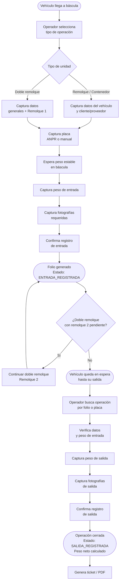

# Manual Operativo / Guía de Uso

---

| Campo              | Detalle                                      |
|--------------------|----------------------------------------------|
| **Proyecto**       | Kiriu Weighing System                        |
| **Versión**        | 1.0                                          |
| **Fecha**          | Abril 2026                                   |
| **Responsable**    | [Completar con información del proyecto]     |

---

## Introducción

Este documento es la guía operativa del sistema **Kiriu Weighing System**. Describe cómo acceder al sistema, cuáles son sus módulos principales y cómo ejecutar los procesos operativos del día a día.

Está dirigido a **operadores de báscula**, **supervisores** y **administradores funcionales** responsables del registro de pesaje vehicular y la administración del sistema. No requiere conocimientos técnicos de software.

La guía cubre los flujos más importantes: registro de entrada, registro de salida, operación de doble remolque y consulta de registros. La administración del sistema (usuarios, roles y permisos) se describe en una sección independiente.

---

## Acceso al sistema

El sistema es una aplicación web accesible desde cualquier navegador moderno (Chrome, Edge, Firefox) dentro de la red de la instalación.

**URL de acceso:** `http://[IP_DEL_SERVIDOR]/[Completar con información del proyecto]`

### Credenciales

El acceso requiere **correo electrónico** y **contraseña** asignados por el administrador del sistema. No existe registro propio de usuario.

### Control de sesión

- El sistema permite **una sola sesión activa por usuario** en cualquier momento.
- Si un usuario inicia sesión desde otro dispositivo, la sesión anterior se cierra automáticamente.
- La sesión expira después de un período de inactividad. Al expirar, el sistema redirige al login.

### Roles principales

| Rol                    | Perfil de uso                                                                    |
|------------------------|----------------------------------------------------------------------------------|
| Administrador          | Acceso completo: pesajes, consultas y administración del sistema                 |
| Operador de báscula    | Registro de entradas y salidas de pesaje; sin acceso a administración            |
| Supervisor / Consultas | Consulta y exportación de operaciones; sin modificación de datos                 |

> Los roles y sus permisos exactos son configurables por el administrador del sistema. La tabla anterior describe perfiles típicos.

---

## Vista general funcional

Al iniciar sesión, el sistema muestra el **menú de navegación** con los módulos disponibles según el rol del usuario.

| Módulo              | Descripción                                                              |
|---------------------|--------------------------------------------------------------------------|
| **Pesaje**          | Registro de operaciones de entrada y salida de vehículos                 |
| **Consultas**       | Búsqueda, visualización y exportación de operaciones registradas         |
| **Administración**  | Gestión de usuarios, roles, permisos y módulos del sistema               |

El módulo de **Pesaje** es el núcleo operativo del sistema. Desde ahí se selecciona el tipo de operación y se inicia el flujo de captura de datos, peso e imágenes.

---

## Operaciones principales

---

### 1. Registro de entrada de vehículo

**Objetivo:** Registrar el ingreso de un vehículo a la báscula, capturando sus datos, peso bruto e imágenes.

**Pasos:**

1. Acceder al módulo **Pesaje** y seleccionar **Nueva entrada**.
2. Seleccionar el **tipo de unidad**:
   - **Remolque**: tráiler estándar con un solo remolque.
   - **Contenedor**: unidad que transporta contenedor ISO.
   - **Doble remolque**: unidad con dos remolques independientes (ver sección específica).
3. Seleccionar si la unidad pertenece a un **cliente** o **proveedor**.
4. Capturar o confirmar la **placa del vehículo**. Si el sistema ANPR está activo, la placa puede capturarse automáticamente; de lo contrario, ingresarla manualmente.
5. Ingresar los datos de la operación:
   - Producto o mercancía.
   - Nombre del cliente o proveedor.
   - RFC (opcional).
6. Esperar a que la báscula muestre un **peso estable** y presionar **Capturar peso**.
7. Capturar las **fotografías** requeridas según el tipo de unidad (placa del tráiler, estado de la carga, remolque).
8. Revisar el resumen y confirmar el registro.

**Resultado esperado:** La operación queda registrada con estatus `ENTRADA_REGISTRADA` y se genera un **folio** único para identificarla durante la salida.

**Consideraciones:**
- El peso solo puede capturarse cuando la báscula indica estabilidad.
- Todas las fotos requeridas deben completarse antes de confirmar.
- El folio generado es el identificador principal para localizar la operación al momento de la salida.

---

### 2. Registro de salida de vehículo

**Objetivo:** Completar el ciclo de pesaje registrando la salida del vehículo, capturando el peso tara y cerrando la operación.

**Pasos:**

1. Acceder al módulo **Pesaje** y seleccionar **Registrar salida**.
2. Buscar la operación de entrada por **folio** o por **placa del vehículo**.
3. Verificar que los datos mostrados corresponden al vehículo en báscula.
4. Esperar a que la báscula muestre un **peso estable** y presionar **Capturar peso de salida**.
5. Capturar las fotografías requeridas del estado de la carga y el vehículo al momento de la salida.
6. Revisar el resumen con los pesos de entrada, salida y **peso neto calculado**.
7. Confirmar el registro de salida.

**Resultado esperado:** La operación pasa a estatus `SALIDA_REGISTRADA`. El sistema muestra el **ticket de pesaje** con el resumen completo (folio, fechas, pesos, datos del vehículo). El ticket puede imprimirse o guardarse como PDF.

**Consideraciones:**
- Solo pueden registrarse salidas de operaciones con estatus `ENTRADA_REGISTRADA`.
- Si la placa de salida no coincide con la de entrada, verificar con el operador antes de proceder.
- El peso neto se calcula automáticamente; no puede modificarse manualmente.

---

### 3. Operación de doble remolque

**Objetivo:** Registrar una operación de pesaje que involucra dos remolques independientes que entran o salen en momentos distintos.

Este flujo es más complejo que el estándar y permite que los dos remolques se procesen de forma independiente, incluso en turnos o momentos diferentes.

#### Entrada de doble remolque

1. Seleccionar tipo de unidad **Doble remolque** al iniciar una nueva entrada.
2. Ingresar los datos generales de la operación (cliente/proveedor, producto).
3. Procesar el **primer remolque**: capturar placa, peso e imágenes.
4. Confirmar el registro parcial del primer remolque.
5. Procesar el **segundo remolque**: capturar placa, peso e imágenes.
6. Confirmar el registro completo de la operación.

> El sistema permite interrumpir el proceso después del primer remolque y retomarlo posteriormente. Para continuar una operación de doble remolque pendiente, seleccionar la opción **Continuar doble remolque** e ingresar el folio o placa de la operación iniciada.

#### Salida de doble remolque

La salida también se registra por remolque individual. El proceso puede completarse en dos momentos distintos:

1. Buscar la operación por folio o placa.
2. Seleccionar el remolque que está saliendo en ese momento.
3. Capturar peso de salida e imágenes del remolque correspondiente.
4. Confirmar la salida parcial.
5. Repetir el proceso para el segundo remolque cuando salga.

La operación se cierra completamente cuando ambos remolques han registrado su salida.

---

### 4. Consulta de operaciones

**Objetivo:** Buscar, visualizar y exportar operaciones de pesaje registradas.

**Pasos:**

1. Acceder al módulo **Consultas**.
2. Aplicar filtros según la necesidad:
   - Rango de fechas.
   - Folio.
   - Placa del vehículo.
   - Estado (`ENTRADA_REGISTRADA` / `SALIDA_REGISTRADA`).
   - Tipo de unidad.
   - Cliente o proveedor.
3. Revisar los resultados en la tabla.
4. Para ver el detalle de una operación, seleccionarla en la lista.
5. Para exportar los resultados, usar el botón **Exportar Excel** o **Generar PDF**.

**Resultado esperado:** Listado de operaciones que cumplen los filtros. El archivo exportado contiene todos los datos relevantes de cada operación.

---

### 5. Administración de usuarios

**Objetivo:** Crear, modificar o desactivar cuentas de usuario del sistema.

> Esta función requiere el permiso de administración de usuarios.

**Pasos para crear un usuario:**

1. Acceder al módulo **Administración** → **Usuarios**.
2. Seleccionar **Nuevo usuario**.
3. Completar: nombre, apellidos, correo electrónico, contraseña y rol asignado.
4. Guardar.

**Consideraciones:**
- El correo electrónico es el identificador de acceso; debe ser único en el sistema.
- Para deshabilitar un usuario sin eliminarlo, cambiar su estado a **Inactivo**.
- Un usuario inactivo no puede iniciar sesión.

---

### 6. Administración de roles y permisos

**Objetivo:** Configurar qué puede hacer cada rol en el sistema.

> Esta función requiere el permiso de administración de roles.

Los permisos están organizados por **módulo** y **tipo de acción** (crear, leer, actualizar, eliminar, exportar). Para modificar los permisos de un rol:

1. Acceder a **Administración** → **Roles**.
2. Seleccionar el rol a modificar.
3. Asignar o quitar los permisos por módulo.
4. Guardar los cambios.

Los cambios aplican inmediatamente para todos los usuarios que tengan ese rol asignado.

---

## Roles y permisos

| Rol                 | Funcionalidades principales                                             | Restricciones típicas                               | Observaciones                                      |
|---------------------|-------------------------------------------------------------------------|-----------------------------------------------------|----------------------------------------------------|
| Administrador       | Acceso total al sistema; gestión de usuarios, roles y permisos          | Ninguna                                             | Debe existir al menos un administrador activo      |
| Operador de báscula | Registro de entradas y salidas; visualización de sus propias operaciones | Sin acceso a administración; sin exportación        | Perfil más común en operación diaria               |
| Supervisor          | Consulta y exportación de todas las operaciones                         | Sin registro de nuevas operaciones ni administración | Adecuado para supervisión y reportes               |

> Los roles y sus permisos son configurables. La tabla anterior describe los perfiles más habituales, pero pueden existir variaciones según la configuración del cliente.

---

## Flujo operativo general

El ciclo de vida de una operación de pesaje sigue el siguiente flujo:

---

## Reglas funcionales importantes

| Regla                                                                 | Detalle                                                                                                    |
|-----------------------------------------------------------------------|------------------------------------------------------------------------------------------------------------|
| Una sesión activa por usuario                                         | Si se inicia sesión desde otro equipo, la sesión anterior se cierra automáticamente                        |
| El folio es único e inmutable                                         | Una vez generado, el folio no puede modificarse                                                             |
| El peso solo se captura cuando es estable                             | El botón de captura de peso solo está activo cuando la báscula indica lectura estable                       |
| Las fotos son obligatorias                                            | No es posible confirmar un registro sin haber capturado todas las fotografías requeridas                    |
| La salida solo aplica a operaciones con entrada registrada            | No puede registrarse una salida sin una entrada previa con estatus `ENTRADA_REGISTRADA`                     |
| El peso neto es automático                                            | Se calcula como la diferencia entre el peso de entrada y el peso de salida; no es editable                  |
| Las ediciones manuales requieren justificación                        | Si se modifican datos de una operación ya registrada, el sistema solicita una justificación obligatoria     |
| El doble remolque puede interrumpirse                                 | Es válido registrar el primer remolque y retomar la operación más tarde para el segundo                     |
| Las fotos se comprimen automáticamente                                | Las imágenes capturadas se reducen antes de almacenarse; esto es transparente para el operador              |

---

## Incidencias comunes

| Situación                                             | Posible causa                                                   | Acción sugerida                                                                              |
|-------------------------------------------------------|-----------------------------------------------------------------|----------------------------------------------------------------------------------------------|
| El peso no aparece o no se actualiza en pantalla      | Pérdida de conexión con la báscula o SerialGateway detenido     | Verificar que la báscula esté encendida y conectada; notificar al área de sistemas            |
| El botón de captura de peso está deshabilitado        | La báscula no indica lectura estable                            | Esperar a que el vehículo esté completamente quieto sobre la báscula                         |
| La cámara no captura la placa automáticamente         | Cámara ANPR sin conexión o vehículo mal posicionado             | Capturar la placa manualmente; notificar a sistemas si el problema persiste                  |
| La foto no se captura o da error                      | Cámara IP sin conexión o con error temporal                    | Intentar capturar nuevamente; si falla persistentemente, notificar a sistemas                |
| No se encuentra la operación al registrar salida      | El folio o placa ingresados no coinciden con ningún registro    | Verificar el folio en el ticket de entrada; revisar en el módulo de consultas                |
| El sistema cierra la sesión inesperadamente           | Sesión iniciada en otro equipo o token expirado                 | Volver a iniciar sesión; si ocurre con frecuencia, reportar al administrador del sistema     |
| Error al exportar a Excel                             | Consulta con demasiados registros o error de conexión            | Reducir el rango de fechas del filtro e intentar nuevamente                                  |
| No es posible modificar datos de una operación        | El usuario no tiene el permiso de edición asignado              | Solicitar al administrador que revise los permisos del rol                                   |
| Aparece el mensaje "sesión iniciada en otro dispositivo" | El sistema detectó un acceso previo activo                  | Es un comportamiento normal; la sesión anterior fue cerrada automáticamente                  |

---

## Buenas prácticas de uso

### Captura de datos

- Verificar visualmente que la placa capturada por ANPR coincide con la del vehículo antes de confirmar.
- Ingresar el nombre del cliente o proveedor de forma consistente para facilitar la consulta posterior.
- Esperar a que el vehículo esté completamente quieto y centrado sobre la báscula antes de capturar el peso.

### Captura de fotografías

- Asegurarse de que las fotos muestran claramente la placa, el estado de la carga y el vehículo.
- No capturar fotografías con obstrucciones, personas en primer plano o con mala iluminación.
- Verificar que las imágenes se guardaron correctamente antes de continuar.

### Gestión de operaciones

- Anotar el folio de cada operación de entrada; es el identificador principal para registrar la salida.
- No abandonar una operación a la mitad sin antes completar o cancelar el proceso; puede dejar fotos huérfanas en el sistema.
- En operaciones de doble remolque, registrar el segundo remolque a la brevedad posible después del primero.

### Administración

- No compartir credenciales de acceso entre operadores; cada persona debe tener su propia cuenta.
- Desactivar usuarios en lugar de eliminarlos cuando un operador deja de usar el sistema.
- Revisar periódicamente los permisos asignados a cada rol y ajustarlos según las necesidades reales.

### Uso responsable

- No registrar pesos sin que el vehículo esté sobre la báscula.
- Si se detecta un error en una operación ya registrada, editar con justificación en lugar de crear un registro duplicado.
- No cerrar el navegador durante un flujo de pesaje en curso; puede resultar en datos incompletos.

---

## Contacto o escalamiento

Ante cualquier falla, duda o incidente que no pueda resolverse con esta guía, seguir el siguiente proceso:

### Antes de escalar, recopilar la siguiente información

| Dato a recopilar                | Descripción                                                          |
|---------------------------------|----------------------------------------------------------------------|
| Usuario afectado                | Correo electrónico del usuario que experimenta el problema           |
| Fecha y hora del incidente      | Momento exacto en que ocurrió la falla                               |
| Módulo o proceso donde ocurrió  | Ej.: "Registro de salida", "Módulo de consultas"                     |
| Mensaje de error visible        | Texto exacto del mensaje mostrado en pantalla (tomar captura si es posible) |
| Folio de la operación afectada  | Si aplica; facilita la trazabilidad del incidente                    |
| Acciones realizadas antes del error | Pasos que se ejecutaron antes de que apareciera el problema      |

### Canales de escalamiento

| Nivel          | Responsable                                   | Cuándo acudir                                              |
|----------------|-----------------------------------------------|------------------------------------------------------------|
| Primer nivel   | Administrador funcional del sistema           | Dudas de uso, configuración de usuarios y permisos         |
| Segundo nivel  | Área de sistemas o soporte técnico            | Fallas de conexión, cámaras, báscula o errores del sistema |
| Proveedor      | [Completar con información del proyecto]      | Defectos de software o problemas que requieren desarrollo  |

---

## Consideraciones finales

El sistema **Kiriu Weighing System** está diseñado para operar de forma continua durante los turnos de trabajo. Su correcto funcionamiento depende de que los operadores sigan el flujo establecido: captura de placa, peso estable, fotografías y confirmación.

La trazabilidad es uno de los valores principales del sistema: cada operación registra quién la ejecutó, cuándo y en qué condiciones. Por ello, es importante que cada operador utilice su propia cuenta y sea cuidadoso con la calidad de los datos capturados.

El módulo de consultas y la exportación a Excel y PDF están disponibles para supervisores y administradores que necesiten información histórica sin interrumpir la operación en la báscula.

---

## Documentos relacionados

| Documento                        | Propósito                                                                                   | Referencia                              |
|----------------------------------|---------------------------------------------------------------------------------------------|-----------------------------------------|
| Arquitectura de la Solución      | Contexto técnico del sistema para equipos de soporte o integración                         | `docs/arquitectura/README.md`           |
| Guía de Instalación y Despliegue | Procedimiento de instalación y configuración de los componentes que soportan este sistema  | `docs/instalacion/README.md`            |
| Diccionario de Datos             | Definición de las entidades y campos que los flujos operativos generan y consultan         | `docs/diccionario-datos/README.md`      |
| README de Entrega                | Estado de entrega y recomendaciones para la operación continua del sistema                 | `docs/entrega/README.md`                |

---

## Pendientes o supuestos

- [ ] Confirmar URL de acceso en producción para incluirla en este documento.
- [ ] Confirmar los nombres exactos de los roles configurados en el ambiente de producción del cliente.
- [ ] Confirmar si existe un proceso de recuperación de contraseña disponible para los usuarios, o si es gestionado exclusivamente por el administrador.
- [ ] Confirmar si el sistema cuenta con un módulo de reportes adicional más allá de la consulta con exportación.
- [ ] Confirmar si el operador puede imprimir el ticket directamente desde el sistema o solo descargarlo en PDF.
- [ ] Confirmar datos de contacto del soporte técnico de primer y segundo nivel para el cliente.
